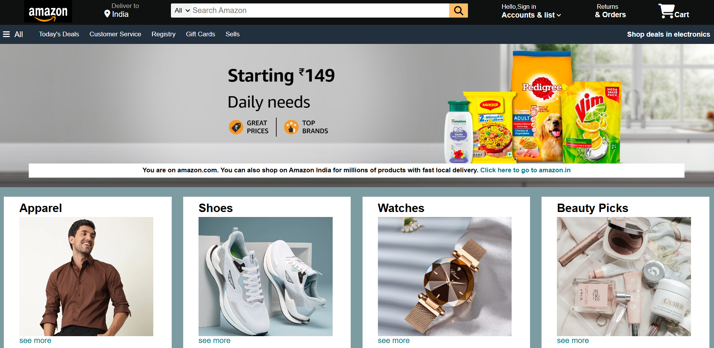

# Amazon-landing-page-clone
Recreating Amazon's homepage UI using pure HTML and CSS

## Overview
This project is a **replica of the Amazon website homepage** created using **HTML and CSS**. It aims to practice and demonstrate frontend web development skills by recreating the layout, styling, and responsiveness of a popular e-commerce homepage.

## Features
- Responsive navigation bar with search bar, logo, and menu links.
- Banner section showcasing promotional content.
- Product showcase sections with images, product names, and prices.
- Footer containing important links and information.
- Clean and modern design using CSS Flexbox and Grid layouts.
- Basic responsiveness to adapt to different screen sizes.

## Technologies Used
- HTML5  
- CSS3 (including Flexbox and Grid)  

## How to View the Project
1. Clone or download the repository to your local machine.  
2. Open the `index.html` file in any modern web browser (such as Chrome, Firefox, or Edge).  
3. Explore the layout and design of the homepage replica.

## Project Structure
Amazon-Homepage-Clone/
│
├── css/
│ └── styles.css 
├── images/ 
│ └── logo.png
│ └── banner.jpg
├── index.html 
└── README.md 

## Screenshots

## Future Improvements
- Add JavaScript for interactivity such as dropdown menus or carousel sliders.  
- Make the page fully responsive across all devices and screen sizes.  
- Add animations and hover effects for buttons and images.  
- Optimize images and improve page load speed.

## Author
Bhoomika Jaiswal
[GitHub](https://github.com/Bhoomikajais) | [LinkedIn](https://www.linkedin.com/in/bhoomika-jaiswal/) | [Email](bhoomikajaiswal0611@gmail.com)
